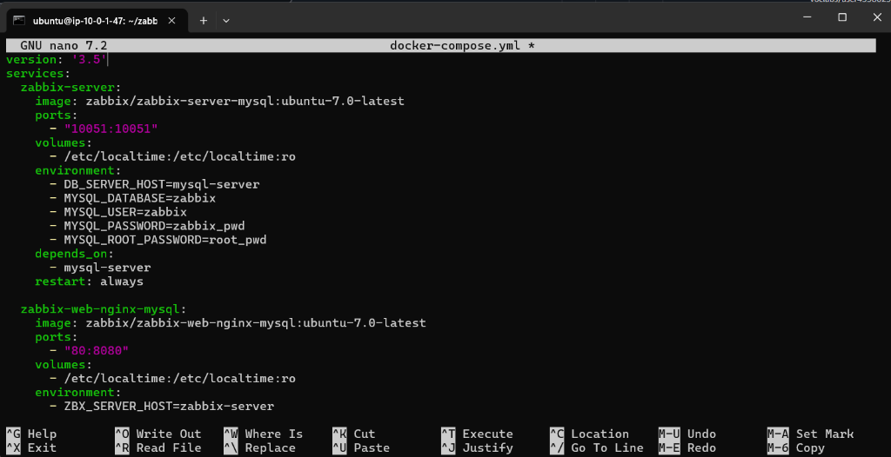
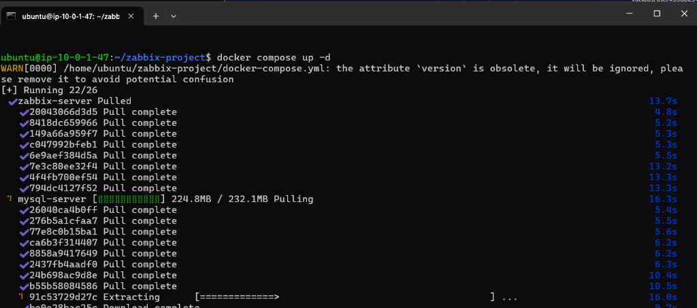
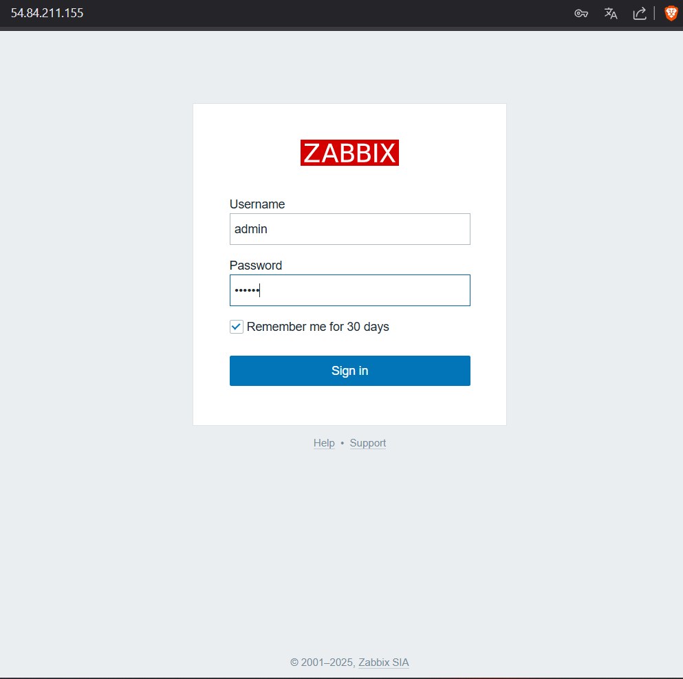
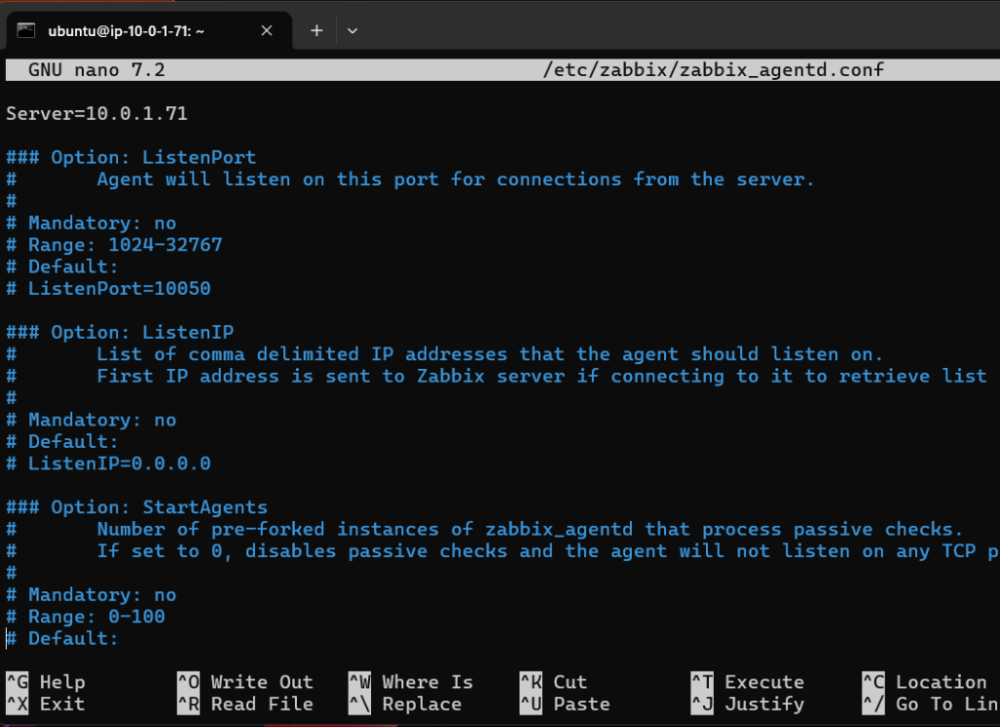
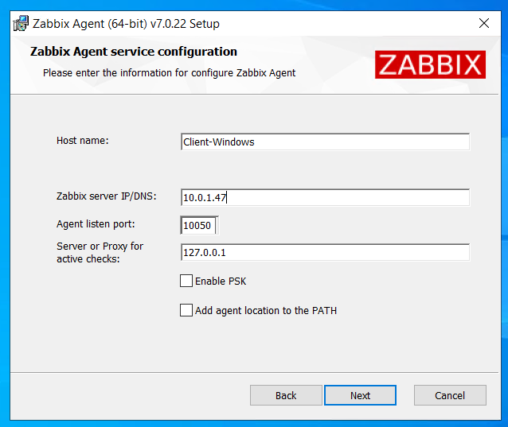
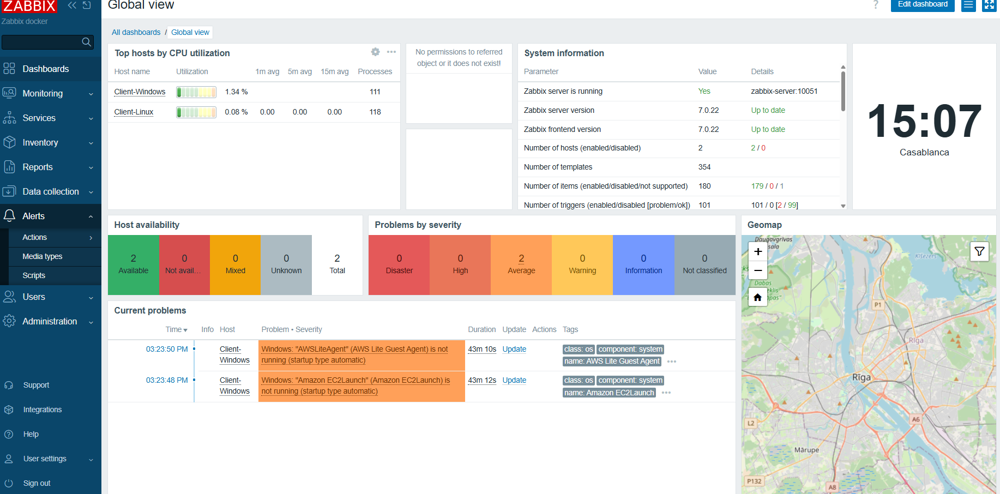

# ☁️ Déploiement d'une Solution de Monitoring Cloud avec Zabbix sur AWS

## 📋 Description du Projet
Ce projet a été réalisé dans le cadre de la formation en ingénierie des infrastructures Cloud à **l'Université Mundiapolis (Année 2025/2026)**.

L'objectif est de mettre en place une infrastructure de surveillance robuste et évolutive hébergée sur AWS. Le cœur du système repose sur un serveur **Zabbix** conteneurisé via Docker, capable de superviser l'état de santé de machines hétérogènes (Linux et Windows) au sein d'un réseau privé virtuel (VPC) sécurisé.

---

## 🏗️ Architecture Technique

### 1. Infrastructure Réseau (VPC & Sécurité)
L'environnement est isolé dans un VPC dédié pour sécuriser les échanges. Les Security Groups ont été configurés strictement pour n'autoriser que les ports nécessaires :
*   **Port 10050/10051** : Communication Agent ↔ Serveur Zabbix.
*   **Port 80/443** : Accès à l'interface Web Zabbix.
*   **Port 22 (SSH) / 3389 (RDP)** : Administration des machines.

### 2. Instances EC2 (Dimensionnement)
Pour simuler un environnement de production, trois instances AWS EC2 ont été déployées :

| Rôle | OS | Type d'Instance | Justification |
| :--- | :--- | :--- | :--- |
| **Serveur Zabbix** | Ubuntu | `t3.large` | Supporte la charge des conteneurs (Server + DB + Frontend). |
| **Client 1** | Ubuntu | `t3.medium` | Simule un serveur d'application Linux. |
| **Client 2** | Windows Server | `t3.large` | Requis pour la fluidité RDP et la RAM (4Go min). |

---

## 🚀 Installation et Déploiement

### Prérequis
*   Un compte AWS actif.
*   Docker et Docker Compose installés sur l'instance serveur.
*   Accès SSH aux instances Linux et RDP à l'instance Windows.

### Étape 1 : Clonage du Dépôt
Récupérez les fichiers de configuration sur l'instance Serveur Zabbix :
```bash
git clone https://github.com/SoufianeMajd/aws-zabbix-monitoring.git
cd aws-zabbix-monitoring
```

### Étape 2 : Lancement du Serveur Zabbix (Docker)
Le déploiement utilise l'image officielle **Zabbix 7.0** via `docker-compose.yml`.



```bash
docker-compose up -d
```


Une fois lancé, l'interface est accessible via l'IP publique de l'instance :
*   **URL** : `http://<IP_PUBLIQUE>`
*   **User** : `Admin`
*   **Password** : `zabbix` (par défaut)



### Étape 3 : Configuration de l'Agent Linux
Sur l'instance client Ubuntu :
1.  Installer l'agent Zabbix via apt.
2.  Éditer `/etc/zabbix/zabbix_agentd.conf` :
    ```ini
    Server=<IP_PRIVEE_SERVEUR_ZABBIX>
    ListenPort=10050
    ```
    

3.  Redémarrer le service agent.

### Étape 4 : Configuration de l'Agent Windows
Sur l'instance Windows Server :
1.  Installer l'agent via l'installateur MSI officiel.
2.  Configurer l'IP du serveur Zabbix lors de l'installation.
    

3.  **Important** : Ouvrir le port `10050` dans le pare-feu Windows Defender.

---

## 📊 Résultats et Monitoring
Le projet permet de visualiser en temps réel :
1.  La disponibilité des hôtes (Indicateur ZBX vert).
2.  L'utilisation CPU et RAM des clients Linux et Windows.
3.  Des alertes en cas de dépassement de seuils critiques.




---

## ⚠️ Difficultés et Solutions
| Problème | Solution |
| :--- | :--- |
| Gestion des règles de flux bidirectionnels (Security Groups) | Utilisation stricte des adresses IP privées du VPC pour sécuriser la communication interne. |
| Délais de détection des alertes trop longs pour la démo | Ajustement des templates Zabbix pour réduire les intervalles de mise à jour. |

---

## 👤 Auteurs
*   **Réalisé par** : Soufiane MAJD
*   **Encadré par** : Prof. Azeddine KHIAT
*   **Contexte** : 2ACI-GB / Ingénierie Informatique
